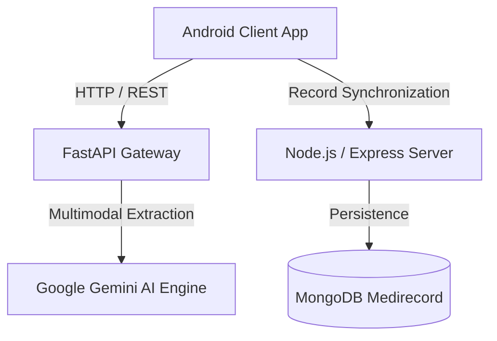

# 🐾 HackHound

> **Intelligent Medical Record Analysis & Healthcare Diagnostics Engine**  
> Built with Android Native, Google Gemini Multimodal AI, FastAPI, Express, and MongoDB.

---

## 📌 Overview

**HackHound** is an end-to-end intelligent healthcare assistant designed to bridge patient medical documentation with real-time AI analytics. The system processes prescription slips, diagnostic reports, and medical imaging to extract clinical insights, verify contraindications, and catalog structured electronic health records (EHR).

---

## 🏗️ Architecture

* **Mobile Frontend**: Android Native client with clean UI, camera capture, and health history dashboards.
* **AI & Vision Pipeline**: FastAPI microservice interfacing with Google Gemini for vision OCR, clinical text parsing, and medical summarization.
* **Backend & Storage**: Express.js REST API handling patient sessions, secure records, and MongoDB database storage.

---

## 🚀 Key Features

* 📷 **Smart Prescription Scanner**: Instant OCR and extraction of drug names, dosages, and usage frequencies.
* 🤖 **Multimodal Gemini AI Integration**: Contextual medical summarization and automated anomaly detection.
* 🔒 **Centralized Health Records**: Secure patient repository for lab results, doctor notes, and past prescriptions.
* ⚡ **High-Throughput Async Backend**: Dual-tier API combining Python FastAPI for compute and Node.js for data ingestion.

---

## 🛠️ Tech Stack

* **Mobile**: Kotlin / Java, Android SDK, Retrofit, Material 3
* **AI / ML**: Google Gemini Multimodal API, Python 3, FastAPI, PIL
* **Backend**: Node.js, Express.js, Mongoose
* **Database**: MongoDB

---

## 📄 License

This project was developed for hackathon innovation and is licensed under the [MIT License](LICENSE).
